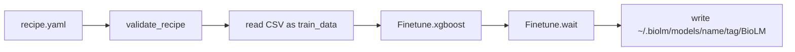

# BioLM Definition Build Implementation Plan

> **For agentic workers:** Use task-by-task execution against this plan. Steps use checkboxes for tracking.

**Goal:** Ship v0 `biolm model build` that compiles a recipe YAML into a locked `BioLM` package via `Finetune.xgboost`, per [docs/superpowers/specs/2026-07-21-biolm-definition-design.md](../specs/2026-07-21-biolm-definition-design.md).

**Architecture:** Library module loads/validates the recipe (dataset-style hand validation), reads local CSV training data, calls existing `Finetune.xgboost` + `Finetune.wait`, then writes `~/.biolm/models/<name>/<tag>/BioLM`. CLI is a thin Click wrapper. Recipe file is never rewritten.

**Tech Stack:** Python, PyYAML, Click, pytest, monkeypatched `Finetune`

**Branch:** From `main` (or `origin/main`): `feat/biolm-model-build`. Cherry-pick or re-add the design spec commit so the branch includes the design spec. This plan lives at `docs/superpowers/plans/2026-07-21-biolm-definition-build.md`.

**Locked defaults (from spec):** tag `latest` (overwrite on rebuild); exactly one `embedding_head` layer; `data` = local CSV path resolved relative to the recipe file’s directory; store absolute `data.path` in the package; digests/artifacts optional; no Hub dataset IDs; no push/deploy.

---

## File structure

| File | Responsibility |
|------|----------------|
| Create `biolm/models/definition.py` | Recipe load/validate, `build_model()`, package write |
| Create `biolm/models/paths.py` | `user_models_dir()` → `~/.biolm/models` |
| Create `biolm/models/errors.py` | `RecipeError` / `BuildError` |
| Modify `biolm/models/__init__.py` | Re-export `build_model` |
| Modify `biolm/cli/__init__.py` | `@model.command("build")` |
| Create `tests/test_model_definition.py` | Schema + build + package layout (mocked Finetune) |
| Create `tests/test_cli_model_build.py` | CliRunner for `biolm model build` |
| Modify `docs/guide/finetuning-models.rst` | Short recipe → package section |
| Modify `docs/cli/usage/models.rst` | Mention `build` |
| Create/keep design + plan under `docs/superpowers/` | Spec already exists; add plan file |

Reuse patterns from `biolm/datasets/schema.py` (hand-validated YAML), `biolm/datasets/paths.py` (`user_config_dir() / "models"`), `biolm/finetune.py` (`xgboost` / `wait`), and `tests/test_finetune.py` / `tests/test_datasets_local.py` (home redirect + monkeypatch).

---

### Task 1: Branch setup

- [x] `git fetch origin && git checkout -b feat/biolm-model-build origin/main`
- [x] Bring design spec onto branch (cherry-pick design commit)
- [x] Write `docs/superpowers/plans/2026-07-21-biolm-definition-build.md` with this plan body
- [ ] Commit: `docs: add BioLM definition build plan`

### Task 2: Paths + errors

- [ ] Add `biolm/models/paths.py` with `user_models_dir() -> Path` using `user_config_dir()` from `biolm/core/paths.py`
- [ ] Add `biolm/models/errors.py` with `RecipeError` and `BuildError`
- [ ] Commit: `feat(models): add models local registry paths and errors`

### Task 3: Recipe validation (TDD)

- [ ] Write failing tests in `tests/test_model_definition.py` for: valid minimal recipe; reject zero/multiple layers; reject non-`embedding_head`; reject missing `from`/`name`/`data`; reject bad `task`
- [ ] Implement `load_recipe(path) -> dict` (or small dataclass) in `biolm/models/definition.py` using `yaml.safe_load` + hand checks (`schema_version` default 1)
- [ ] Resolve `data` path: if relative, resolve against `recipe_path.parent`; require file exists
- [ ] Run tests until green; commit: `feat(models): validate BioLM definition recipes`

### Task 4: `build_model` + package write (TDD)

- [ ] Tests with `tmp_path` + monkeypatched `Path.home` (or `user_models_dir`) and monkeypatched `Finetune.xgboost` / `Finetune.wait`:
  - Returns package path; writes `BioLM` YAML
  - Manifest has `tag`, `from.slug`, layer `run_id`, `data.path` absolute, `actions.encode`/`predict`, `built.status: locked`
  - Recipe file bytes unchanged after build
  - Overwrite existing `latest` tag dir
  - Failed wait (`status: failed`) raises `BuildError` and does not write a locked package
- [ ] Implement `build_model(recipe_path, *, tag="latest", name=None, api_key=None) -> BuiltPackage` (simple dataclass: `path`, `manifest`)
  - Read CSV file text → `train_data` string for `Finetune.xgboost`
  - Map: `embedding_models` default `[from]`; `task` → `task_type`; optional `target_column`/`text_column`
  - `run_name` default to recipe `name`
  - `Finetune.wait(run_id)`; on non-`succeeded` raise
  - Write `user_models_dir() / name / tag / "BioLM"` via `yaml.safe_dump`
  - Optional: copy `artifact`/`metrics` from wait payload if present keys exist (best-effort)
- [ ] Export `build_model` from `biolm/models/__init__.py`
- [ ] Commit: `feat(models): build embedding_head recipes into BioLM packages`

### Task 5: CLI `biolm model build`

- [ ] Test with `CliRunner`: `biolm model build <recipe> --tag v1` calls `build_model` (patch where used in CLI) and prints package path; bad recipe → non-zero exit
- [ ] Add `@model.command("build")` in `biolm/cli/__init__.py` near other model commands:
  - Argument `path` (`click.Path(exists=True)`)
  - Options `--tag` (default `latest`), `--name` (optional override)
  - Catch `RecipeError`/`BuildError`/`PermissionError` with Rich error panel; exit 1
- [ ] Commit: `feat(cli): add biolm model build`

### Task 6: Docs

- [ ] Add a short section to `docs/guide/finetuning-models.rst`: recipe vs `BioLM` package, example YAML, `biolm model build`, local registry path (Docker/dbt one-liners)
- [ ] Update `docs/cli/usage/models.rst` to mention `build`
- [ ] Commit: `docs: document BioLM definition build`

### Task 7: Verify

- [ ] Run `pytest tests/test_model_definition.py tests/test_cli_model_build.py tests/test_finetune.py -q`
- [ ] Confirm recipe unchanged and package layout in a manual smoke with mocks if needed

---

## Out of scope (do not implement)

Push/deploy, MLflow `MLmodel` sidecar, DSM layers, Hub dataset refs, JSON Schema files, rewriting the recipe, multi-layer stacks, full Finetune knob pass-through.
